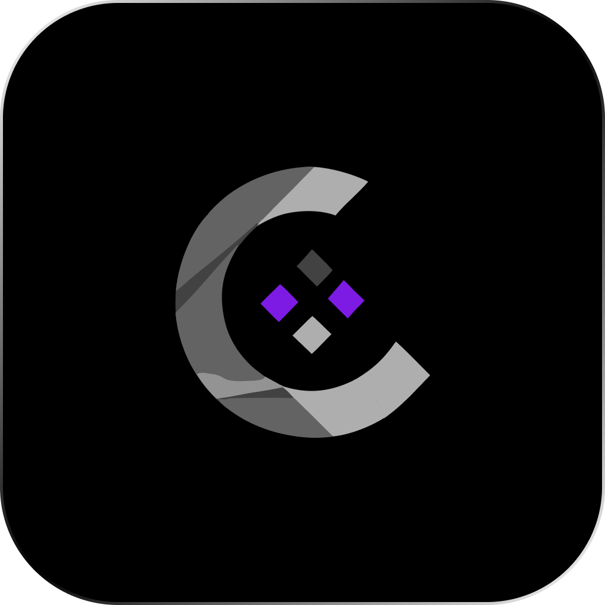

<p align="center">
  
</p>

# Codrax

Cockpit d'orchestration desktop pour les vibe coders utilisant Claude Code.

Codrax relie un Kanban à des terminaux natifs : tu crées une tâche, tu la glisses dans une colonne, un agent AI (Claude Code, Codex, Kimi…) démarre automatiquement dans un terminal dédié. Quand la tâche est terminée, commit git automatique.

## Ce que Codrax n'est pas

- Pas un IDE — Claude Code s'occupe de l'édition de code
- Pas un chat AI custom — les agents tournent dans des terminaux natifs via CLI
- Pas un concurrent direct à Cursor ou Windsurf

## Ce que Codrax est

- Un Kanban intelligent lié à des terminaux PTY natifs
- Un orchestrateur de pipelines d'agents AI (Codex → Claude Code → Kimi → commit)
- Un outil de visualisation de l'avancement d'un projet vibe coding

## Stack technique

| Composant | Choix |
|---|---|
| App desktop | Tauri 2 (Rust + WebView) |
| Frontend | React 19 + TypeScript + Vite |
| Styling | Tailwind v4 + shadcn/ui |
| State | Zustand |
| Kanban DnD | dnd-kit |
| Terminal UI | @xterm/xterm + @xterm/addon-webgl |
| Terminal PTY | portable-pty (Rust) |
| Git | git2 (Rust) |
| Auth + licences | Supabase |
| Paiements | Polar.sh |

## Pipeline par défaut

```
Codex (réflexion/plan) → Claude Code (build) → Kimi (review) → git commit
```

Chaque projet peut définir son propre pipeline par défaut ; chaque carte peut l'override.

## OS supportés

macOS (cible principale) · Windows · Linux (best effort)

## Statut

Projet en développement actif — voir les priorités MVP dans la documentation interne du projet.

## Licence

Functional Source License, Version 1.1, MIT Future License (FSL-1.1-MIT) — voir [LICENSE](LICENSE).

En résumé : le code source est disponible et modifiable librement, mais il est interdit de l'utiliser pour lancer un produit concurrent pendant 2 ans à partir de chaque version publiée. Passé ce délai, chaque version bascule automatiquement sous licence MIT.
